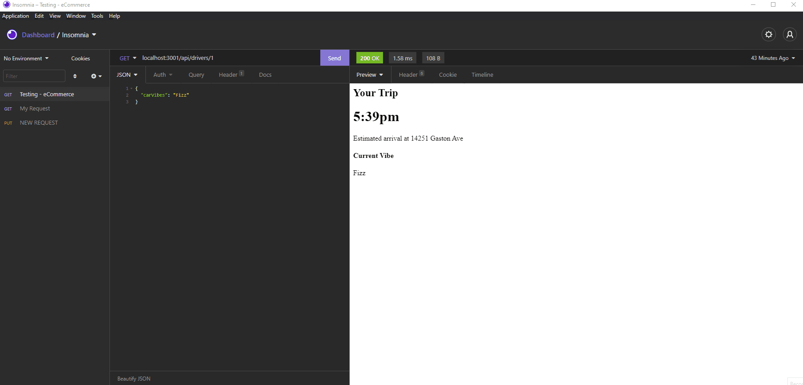

# alto-rideshare_node-app

## **Description**

The objective of this node application is to render an Alto Rideshare user's trip information, destination info, assigned driver, and the app user's assigned vehicle make/model. All these retreivals are created through rest API routes created through express library.

## **How it's Built**

- Used npm package Express.js to establish a server for the api routes
- Routes were created to render information based on the Alto Rideshare user's data
- Used mock data as endpoints

## **Usage**

To utilize this application, first clone the following git repository

    //enter this git clone into terminal
    https://github.com/pazjenni04/alto-rideshare_node-app.git

Once cloned, you can then proceed with downloading the following npm package by entering

    npm install express

This will allow the application install the necessary express library to run the server and render the established routes. Once downloaded, proceed with typing in the following to run the app locally

    npm run start

or

    node server.js

into the terminal to start the server on localhost 3001 and then proceed with typing in the below routes into the URL or into your preferred API Client to render individual user's data.

## **Routes**

### **_Assigned Driver_**

To render a user's assigned driver's information, the following GET route was established. Proceed with typing in the following pathway to either the browser's URL or in your preferred API Client

    localhost:3001/api/drivers/:id

To render a specific user, please update the `/:id` at the end of the pathway with one of the Alto user's ID (mock data includes users attached to ids 1, 2, or 3). After you have pressed enter, the window should display the Alto user's assigned driver info including the driver's name, a brief bio and will display the user's final dropoff destination as well.

This process can be repeated with any user within the data folder under the users.js file by inserting their assigned ID.

### **_Trip Information_**

To render an Alto user's Trip information, the following GET route was created. Proceed with typing in the following into the browser's URL or in your preferred API Client

    localhost:3001/api/user/trip/:id

To render a specific user, please update the `/:id` at the end of the pathway with one of the Alto user's ID (mock data includes users attached to ids 1, 2, or 3).

Displayed onto the page should include the Alto user's arrival time, destination address, their estimated fare, the payment type, the amount of passengers that can ride along, and their pickup location.

This process can be repeated with any user within the data folder under the users.js file by inserting their assigned ID.

### **_Vehicle Information_**

To render an Alto user's vehicle information, the following GET route was created. Proceed with typing in the following into the browser's URL or in your preferred API Client

    localhost:3001/api/user/vehicle/:id

To render a specific user, please update the `/:id` at the end of the pathway with one of the Alto user's ID (mock data includes users attached to ids 1, 2, or 3).

This window should display the vehicle's information for the user - this will include the Alto number attached to the vehicle, the make/model, the vehicle's color, and the dropoff location.

### **_Vibe Information_**

At anytime, the Alto user can choose their vehicle's vibe. To have a more enjoyable experience, Alto Rideshare allows its users to control their vehicle's vibe by choosing which music or sound atmosphere they would like to have during their trip. To render an Alto user's current vibe assigned to their vehicle, you can type the following GET route into the browser's URL or into your preferred API Client.

    localhost:3001/api/user/vibe/:id

By updating the `:/id` at the end of the pathway with one of the Alto user's ID (mock data includes users attached to ids 1, 2, or 3), you can render the Alto user's current vibe in the vehicle along with the trip's estimated time of arrival and dropoff location.

To update the user's vehicle vibe, a patch route was created to isolate and only update the user's current vibe station.

    localhost:3001/api/user/vibe/:id

In your preferred API Client, insert the above PATCH route and in the json body, you can update the 'carVibes' within the data with the name of your preferred vibe station. This should return the user's data information as a whole and under the 'carVibes' property within the json data, the vibe station should be updated to the PATCH request. If you proceed with running the GET route for that same user, the new vibe should be displayed onto the page.

## **Demo**

Github Link - https://github.com/pazjenni04/alto-rideshare_node-app.git

## **Questions**

_Questions? Feel free to contact me._

- Via [Gtihub](https://github.com/pazjenni04)
- Via [Email](pazjenni1331@gmail.com)

# License

